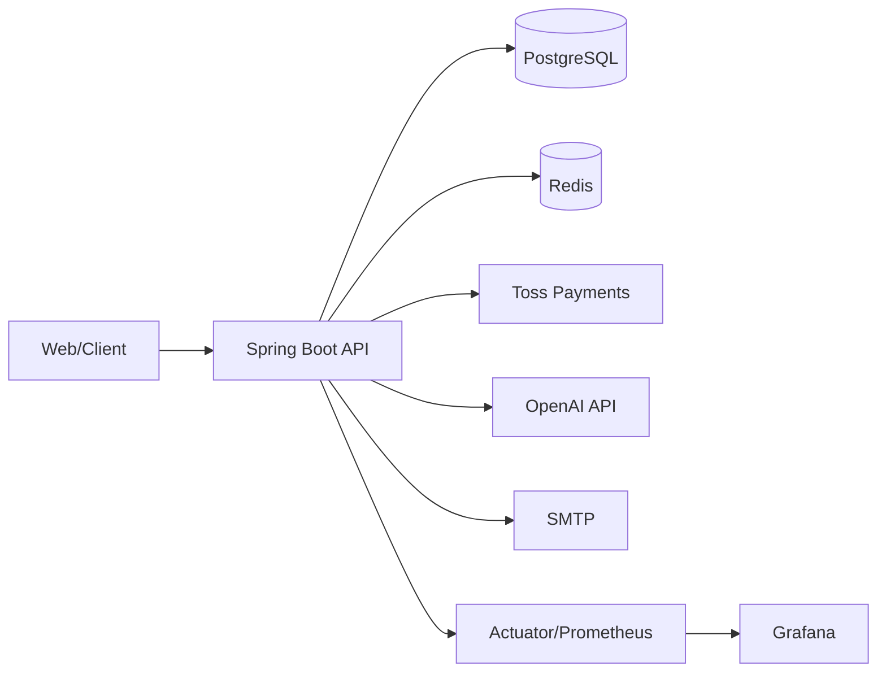
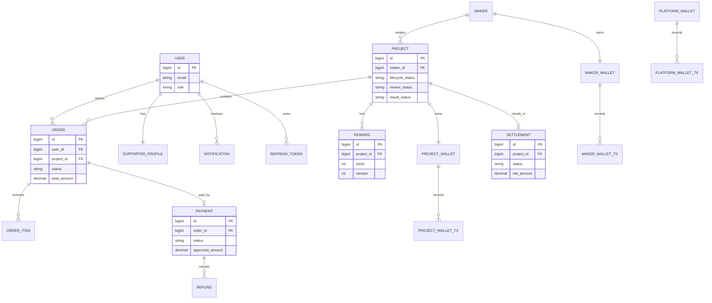

# MOA Backend

크라우드펀딩 플랫폼 **MOA**의 백엔드 API 서버입니다.  
프로젝트 공개/심사, 주문/결제, 재고 동시성 제어, 정산/배송, 알림, 관리자 통계 기능을 제공합니다.

## 프로젝트 개요

MOA Backend는 크라우드펀딩 서비스의 핵심 트랜잭션을 안정적으로 처리하는 것을 목표로 합니다.

- **도메인 중심 설계**: `project`, `order`, `payment`, `settlement`를 분리해 변경 영향을 최소화
- **정합성 우선**: 주문-결제-정산-환불 흐름에서 상태 전이를 명시적으로 관리
- **고경합 대응**: 재고 차감에 Redis Lua 원자 연산과 보상 트랜잭션 적용
- **운영 가시성**: Actuator + Prometheus + Grafana + k6로 성능/장애 지표 추적

## Tech Stack

- Java 17
- Spring Boot 3.5.7
- Spring Security (JWT, OAuth2)
- Spring Data JPA (Hibernate), PostgreSQL, H2(test)
- Redis (재고 선차감/보상, 캐시성 워크로드)
- Swagger/OpenAPI (`springdoc`)
- Micrometer + Prometheus + Grafana
- Gradle

## 주요 기능

- 인증/인가: 이메일 로그인 + JWT, Google/Kakao OAuth2
- 프로젝트 도메인: 생성/임시저장/심사/상태 전이
- 주문/결제: 주문 생성, 토스 결제 승인/취소, 환불
- 재고 동시성: Redis Lua 기반 all-or-nothing 선차감 + DB 실패 시 보상
- 정산/지갑: 프로젝트/플랫폼/메이커 지갑 및 정산 플로우
- 배송: 메이커 배송 관리 + 자동 상태 전이
- 알림: SSE 기반 실시간 알림
- 운영 기능: 관리자 통계, k6 부하 테스트, Prometheus/Grafana 모니터링

### 기능 상세

| 도메인 | 핵심 기능 |
|---|---|
| Auth/User | 회원가입/로그인, JWT 재발급, OAuth2 소셜 로그인, 이메일 인증/비밀번호 재설정 |
| Project | 프로젝트 작성/임시저장, 심사 요청/승인/반려, 공개 상태 전이 |
| Order/Stock | 주문 생성/취소, 재고 차감/복구, 동시성 충돌 제어 |
| Payment | 토스 결제 승인/취소(환불), 금액 검증, 중복 승인 방지 |
| Settlement/Wallet | 프로젝트 성공 시 정산 생성, 선지급/잔금 지급, 지갑 트랜잭션 관리 |
| Shipment | 송장 등록, 배송 상태 변경, 스케줄러 기반 자동 전이 |
| Notification | SSE 구독, 읽지 않은 알림 수, 이벤트 기반 알림 발행 |
| Admin/Stats | 프로젝트 심사 콘솔, 대시보드/매출/퍼널 통계 API |

## 아키텍처

### 애플리케이션 레이어

```text
[Client]
   |
   v
[Controller]  -> 요청/응답 DTO, 인증 컨텍스트 처리
   |
   v
[Service]     -> 유스케이스/트랜잭션 경계, 도메인 규칙 오케스트레이션
   |
   v
[Repository]  -> JPA 기반 영속성 접근
   |
   v
[PostgreSQL]
```

### 인프라 아키텍처



## ERD (핵심 도메인)

아래는 주문-결제-정산 플로우 중심의 핵심 엔티티 관계입니다.



## 프로젝트 구조

```text
src/main/java/com/moa/backend
├─ domain/        # 비즈니스 도메인 (user, project, order, payment, settlement ...)
├─ external/      # 외부 연동 클라이언트 (tosspayments 등)
└─ global/        # 공통 설정/보안/예외/초기화
```

## 빠른 시작 (로컬 개발)

### 1) 필수 조건

- JDK 17
- Docker Desktop
- (선택) k6

### 2) 인프라 실행

```bash
docker compose up -d postgres redis prometheus grafana
```

- PostgreSQL: `localhost:5432` (db: `moa`, user: `moa`, password: `moa1234`)
- Redis: `localhost:6379`
- Prometheus: `http://localhost:9090`
- Grafana: `http://localhost:3000` (`admin` / `admin`)

### 3) 환경변수 설정

아래 값은 애플리케이션 실행 전에 설정해야 합니다.

```bash
JWT_SECRET=change-me-to-secure-key-change-this-in-prod
GOOGLE_CLIENT_ID=dummy
GOOGLE_CLIENT_SECRET=dummy
KAKAO_CLIENT_ID=dummy
KAKAO_CLIENT_SECRET=dummy
NAVER_MAIL_USERNAME=dummy
NAVER_MAIL_PASSWORD=dummy
TOSS_CLIENT_KEY=test
TOSS_SECRET_KEY=test
OPENAI_API_KEY=sk-dummy
```

### 4) 애플리케이션 실행

```bash
./gradlew bootRun
```

Windows PowerShell:

```powershell
.\gradlew.bat bootRun
```

기본 프로필은 `dev`이며, `application-dev.yml` 기준으로 로컬 PostgreSQL/Redis를 사용합니다.

## API 문서 / 헬스체크

- Swagger UI: `http://localhost:8080/swagger-ui/index.html`
- OpenAPI JSON: `http://localhost:8080/v3/api-docs`
- Actuator: `http://localhost:8080/actuator`
- Prometheus metrics: `http://localhost:8080/actuator/prometheus`

## 테스트

```bash
./gradlew test
```

테스트 프로필은 `src/test/resources/application-test.yml`을 사용하며, H2 기반으로 동작합니다.

## 부하 테스트 (k6)

상세 절차는 `k6/RUNBOOK.txt` 참고.

요약:

1. 서버 실행
2. `POST /public/test-init` 로 테스트 데이터 초기화
3. `GET /public/k6-tokens` 또는 스크립트로 `k6/tokens.json` 생성
4. `k6 run k6/k6-load-test.js` 실행

## Docker 실행 (애플리케이션)

```bash
docker build -t moa-backend .
docker run -p 8080:8080 moa-backend
```

## 참고 문서

- 동시성/성능 개선 히스토리: `docs/CHANGELOG-2026-04-30-order-concurrency.md`
- 트러블슈팅 아카이브: `docs/TROUBLESHOOTING-ARCHIVE.md`

---

마지막 업데이트: 2026-04-30
